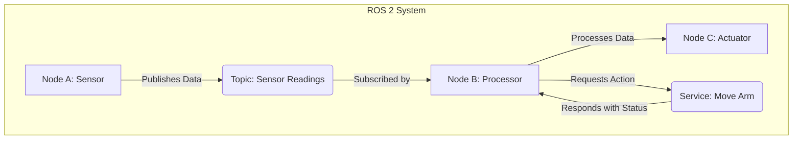
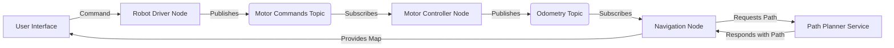

# Chapter 1: Core Concepts

This chapter introduces the fundamental concepts of ROS 2. By the end of this chapter, you will understand the basic building blocks of a ROS 2 system and how they interact with each other. This is the essential foundation for building any robot with ROS 2.

## ROS 2 Nodes

A ROS 2 **Node** is the primary building block of a ROS 2 system. You can think of a node as a process that performs a specific task. For example, you might have a node for controlling a robot's wheels, a node for reading sensor data, and a node for planning a path.

Each node in a ROS 2 system can communicate with other nodes using ROS 2's communication features, such as Topics and Services. This allows you to build a complex system from small, reusable components.

## ROS 2 Topics

**Topics** are named buses that nodes use to exchange messages. Topics use a **publish/subscribe** model. A node can **publish** messages to a topic, and any number of other nodes can **subscribe** to that topic to receive the messages.

This one-to-many communication model is very flexible and is the most common way for nodes to communicate in ROS 2. For example, a camera node could publish images to an `/image` topic, and both an image processing node and a display node could subscribe to that topic to receive the images.

## ROS 2 Services

**Services** are another way for nodes to communicate in ROS 2. Unlike topics, services use a **request/response** model. One node acts as a **service client** and sends a **request** to a **service server**. The server processes the request and sends back a **response**.

This one-to-one communication model is useful when you need a direct confirmation that a request has been processed. For example, you might use a service to request a robot to move to a specific location. The service server would handle the movement and then send a response indicating whether the movement was successful.

### Diagrams and Examples

**Diagram of Nodes, Topics, and Services:**

This diagram provides a more comprehensive view of the fundamental communication patterns in ROS 2, including styling for better visual distinction:

**Example of a simple ROS 2 system:**

This diagram provides a conceptual overview of a basic ROS 2 system with several nodes communicating via topics and services.

