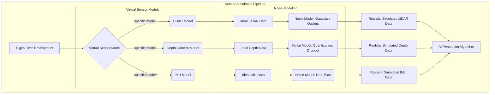

# Chapter 3: Sensor Simulation for Perception

This chapter delves into the simulation of various sensors crucial for robotic perception. Accurate and realistic sensor data from digital twins is vital for developing and testing perception algorithms for AI agents. By simulating sensors like LiDAR, depth cameras, and IMUs, we can rapidly iterate on algorithms without requiring expensive physical hardware.

## Simulating LiDAR, Depth Cameras, and IMUs

Digital twins can incorporate virtual representations of physical sensors, generating data streams that closely mimic their real-world counterparts.

### LiDAR Simulation

**LiDAR (Light Detection and Ranging)** sensors measure distances to objects by emitting pulsed laser light. In simulation, this involves casting rays into the 3D environment and calculating intersection points to generate a point cloud.
-   **Output**: Point clouds (3D coordinates of detected points).
-   **Simulation aspects**: Number of lasers, scan rate, angular resolution, maximum range.

### Depth Camera Simulation

**Depth cameras** provide an image where each pixel's value indicates the distance to the scene object. Simulation often uses GPU-accelerated rendering to generate depth maps from a virtual camera's perspective.
-   **Output**: Depth images, RGB images (if RGB-D camera).
-   **Simulation aspects**: Field of view, resolution, minimum/maximum depth range.

### IMU Simulation

**IMU (Inertial Measurement Unit)** sensors measure a robot's orientation and linear acceleration. In simulation, IMU data is derived directly from the robot's kinematics and dynamics within the physics engine.
-   **Output**: Linear acceleration, angular velocity, orientation (roll, pitch, yaw).
-   **Simulation aspects**: Sampling rate, axis alignment.

## Noise Models and Realism Constraints

To make simulated sensor data truly useful for training and testing AI agents, it's essential to incorporate realism constraints, particularly through **noise models**. Real-world sensors are imperfect and introduce various forms of noise and inaccuracies.

### Noise Models

Noise models attempt to mimic these imperfections. For example:
-   **Gaussian noise**: Random fluctuations around the true value.
-   **Drift**: Slow, unpredictable changes over time (common in IMUs).
-   **Outliers**: Sporadic, erroneous readings (e.g., from LiDAR reflections).
-   **Resolution and quantization effects**: Limitations due to sensor hardware.

By adding these noise models to simulated sensor data, the AI agent can be trained to be more robust to real-world sensor imperfections.

### Realism Constraints

Beyond noise, other factors contribute to realism:
-   **Environmental factors**: Light conditions for cameras, fog/rain for LiDAR.
-   **Sensor mounting**: Obstructions, vibrations.
-   **Calibration errors**: Inaccuracies in sensor alignment.

Understanding and modeling these constraints allows for more effective transfer learning from simulation to the real world.

### Examples and Conceptual Code


**Conceptual Python snippet for adding noise to simulated data:**

```python
# Consider adding a Python snippet here that demonstrates applying noise (e.g., Gaussian) to sensor readings.
```

### Detailed Sensor Simulation Pipeline

This comprehensive diagram illustrates the sensor simulation pipeline, detailing how a digital twin environment, various virtual sensor models (LiDAR, Depth Camera, IMU), and sophisticated noise models combine to produce realistic simulated sensor data for AI perception algorithms.


