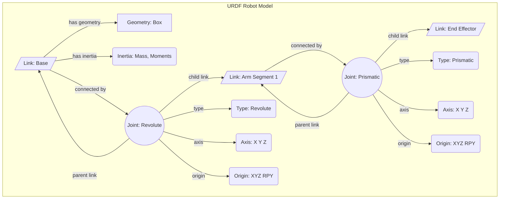

# Chapter 3: Humanoid Modeling with URDF

This chapter introduces the Unified Robot Description Format (URDF), which is an XML-based file format used to describe the physical structure of a robot. URDF is a fundamental tool in robotics for modeling, simulation, and visualization. By the end of this chapter, you will be able to read and understand a basic URDF file.

## The `<link>` and `<joint>` Elements

The two most important elements in a URDF file are `<link>` and `<joint>`.

-   A **`<link>`** element describes a rigid part of the robot, such as a limb or a sensor. It has properties such as mass, inertia, and visual and collision geometry.
-   A **`<joint>`** element describes the connection between two links. It defines the type of motion allowed between the links, such as revolute (rotating) or prismatic (sliding).

By connecting a series of links and joints, you can create a kinematic chain that represents the structure of your robot.

### Detailed URDF Structure Diagram

This diagram provides a more detailed visualization of the hierarchical relationship between links and joints in a URDF model, illustrating their properties and connections with distinct styling.



### URDF Example: Robot Arm

Here is a simple example of a URDF for a two-link robot arm:

```xml
<?xml version="1.0"?>
<robot name="my_robot_arm">
  <link name="base_link">
    <visual>
      <geometry>
        <cylinder length="0.1" radius="0.1"/>
      </geometry>
    </visual>
  </link>

  <link name="link1">
    <visual>
      <geometry>
        <box size="0.5 0.1 0.1"/>
      </geometry>
    </visual>
  </link>

  <joint name="joint1" type="revolute">
    <parent link="base_link"/>
    <child link="link1"/>
    <origin xyz="0 0 0.05"/>
    <axis xyz="0 0 1"/>
  </joint>

  <link name="link2">
    <visual>
      <geometry>
        <box size="0.5 0.1 0.1"/>
      </geometry>
    </visual>
  </link>

  <joint name="joint2" type="revolute">
    <parent link="link1"/>
    <child link="link2"/>
    <origin xyz="0.5 0 0"/>
    <axis xyz="0 1 0"/>
  </joint>
</robot>
```

In this example, we have three links: `base_link`, `link1`, and `link2`. The `base_link` is connected to `link1` by `joint1`, and `link1` is connected to `link2` by `joint2`. Both joints are of type `revolute`, meaning they can rotate. This simple URDF file describes the complete kinematic structure of our robot arm.
